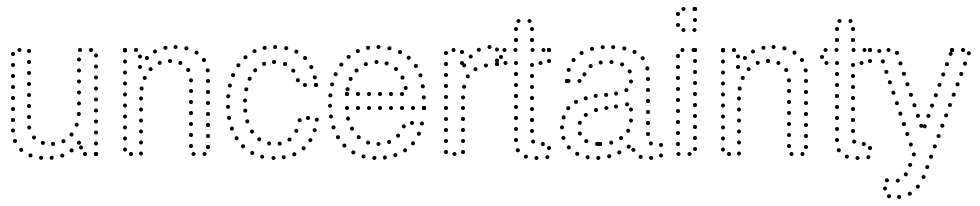
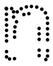
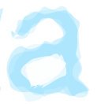
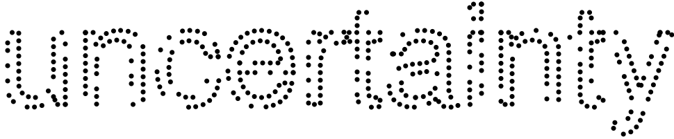
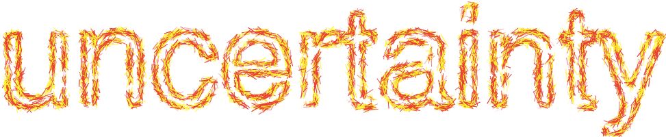
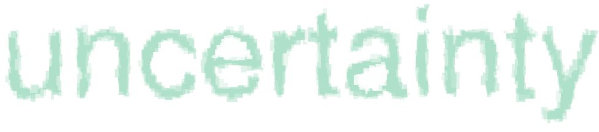

# Design Brief: Identity for website on the visualization of uncertainty in data

From *The Grammar of Graphics*, Leland Wilkinson, Second Edition (2005), p. 451:  
> The word *uncertainty* derives from the Latin adjective *certus* (determined, fixed, settled), which itself is derived from the verb *cernere* (to discern or perceive, usually with the eyes). This etymology is relevant to our perspective on graphics and aesthetics because we encounter uncertainty when we are unable to perceive without doubt (*sine dubio*).

## Identity for website

The details on the landing page for this website ([http://www.visualizeuncertainty.io/](http://www.visualizeuncertainty.io/)) will be defined in a separate brief. The site will contain tools, resources, writing, code, etc.--all related to the visualization of uncertainty in data. However, this brief is specific to the identity/graphic for that site. 

# Designing the identity for www.visualizeuncertainty.io

The identity (branding image/logo/graphic) for the site is meant to title the landing page and also convey the essence of the topic: the visualization of uncertainty in data. It should be responsive, sized at (including padding/whitespace):  

* 1240 x 256 pixels, largest version, desktop  
* 320 x 568 pixels, smallest version, phone (iPhone SE)  
* and everything in between (note that the aspect ratio will have to change somewhere in between)  

The basis for identity will be the word "uncertainty." A typeface will be chosen through the design process (the prototypes use `FreeSans.ttf`). The typeface will be interpreted geometrically** and the resulting shapes will be treated as "data", which will become the basis for a generative typeface for the word *uncertainty*. 

> **NOTE: This is done using the [Geomerative library](http://www.ricardmarxer.com/geomerative/) in [Processing](https://processing.org/) to interpret a font and expose its shapes (paths, handles, and points).  

For example, here are the points for `FreeSans.ttf`: 

&nbsp;&nbsp;&nbsp;&nbsp;&nbsp;&nbsp; [**view in browser**](http://www.visualizeuncertainty.io/title/d.html)

## The system for the generative typeface

Rules for this generative typeface: 

1. The "data" from the word *uncertainty* must be treated as though it were uncertain data in a visualization.  
2. The rendering of the variations of the typeface must happen in [D3.js](https://d3js.org/), a popular JavaScript library for interactive data visualization. This constraint is deliberate; the identity then also serves as a proof of concept that artistic expression is possible in data visualization software. (Note: the D3 coding is not part of this project.)  

Following the Bertin model (detailed in the design brief for the interface to the arts database), the "points" in the typeface will serve to mark the three types of signification--point, line, and area. For **point**, the points are simply points. For **line**, the points are separated into pairs that become starting and ending points for lines; for example, points A, B, and C become pairs that can mark three lines: AB, BC, and CA. For **area**, the points define the path that outlines the shape of a given letter. One example each for point, line, and area:  

  

Each of the marks--whether point, line, or area--can be modified with the seven Bertin visual variables:  

**SIZE** variations in height, width, area

**VALUE** the various degrees between white and black

**TEXTURE** variation in the fineness or coarseness of an area having a given value; includes blur

**COLOR** hue, using the repertoire of colored sensations which can be produced at equal value

**ORIENTATION** various orientations, ranging from the vertical to the horizontal in a distinct direction 

**SHAPE** a mark with a constant size can nonetheless have an infinite number of different shapes

**PLACEMENT** given location on the planar dimensions

The first six visual variables listed require no further explanation. The final variable (*placement*) requires some elaboration on ways that it can be used to express uncertainty: 

> Placement in a coordinate system can be altered in various ways that are consistent with the statistical properties of uncertainty in data, both in how uncertainty is estimated and how uncertain data performs relative to a hypothetical "certain" dataset. 

> For example, let's say an election poll estimates that a candidate will receive 60% of the votes. That point estimate (60%) comes with a margin of error to express the uncertainty in the data. "Placement" might be used to animate the various possibilities where the real value might be. So the point might be animated move around within the margin of error (and even outside the margin of error given that 5% of the time the value isn't even within that margin).  

> Another example: weather forecasts are based on thousands of simulations. For example, here's what hurricane simulations look like:  
> 

> Yet by the time laypeople see the graph, it has been abstracted by aggregating the results of those simulations:  
>   

> *Placement* might be used instead of the "hurricane cone" abstraction to show the variability of the forecast in different ways.  

> This is where a good working knowledge of statistics comes in handy. Because there are many, many ways that values can vary statistically; those variations can be visualized. For background, here's a good list of the kinds of statistical phenomena that could be represented with *placement*, from [The Grammar of Graphics](http://a.co/4qr4Tiy):  

> * *Variability* is non-constancy. A set of data is variable if it has two or more elements and if any two of its values differ. Data variability leads to uncertainty only if we do not know how it occurs.  
* *Noise* is variability produced by a [stationary stochastic process](https://en.wikipedia.org/wiki/Normal_distribution). Perhaps the most obvious example is Gaussian white noise in a linear system. Noise produces uncertainty because it is random.  
* *Incompleteness* is the presence of missing data. Missing values can be produced by breakdowns in equipment, refusal to answer questions, confidentiality restrictions, and other factors. Missing values produce uncertainty when we cannot reliably impute them.  
* *Indeterminacy* is the existence of more than one set of parameter values satisfying the conditions of a model and its associated data.  
* *Bias* is systematic discrepancy from a standard, as in a biased opinion. Measurement bias is systematic discrepancy between a true value that we attempt to measure and an observed measurement of the value.  
* *Error* is random discrepancy between a measured and true value. Unlike bias, error varies to the left or right of the truth with equal likelihood.  
* *Accuracy* is relative lack of bias and error. If a measurement is representable by the equation measurement = truth + bias + error, then a high level of accuracy reflects a high level of truth in the measurement.  
* *Precision* is relative lack of error. A highly precise measurement can be biased. We associate significant digits (the number of digits in a measurement that are not affected by error) with precision of a measurement.  
* *Reliability* is the repeatability of a measurement over time. The smaller the variance in a series of measurements, the higher their reliability.  
* *Validity* is the association of a measurement with the true process generating what is measured. A valid measurement need not measure a variable itself. It simply needs to measure something perfectly correlated with what is measured under all relevant measuring conditions.  
* *Quality* is a combination of completeness, reliability, and validity.  
* *Integrity* is the presence of information that allows a judge to establish quality. This usually involves an audit trail or lineage for a set of measurements and the context in which they were made.  

## Early prototypes

### POINT

**Repeated random samples** (of ~80%) are taken of the points. Each animation shows a different random sample. The time between transitions is also random, ranging from zero to ten seconds between transitions. 

&nbsp;&nbsp;&nbsp;&nbsp;&nbsp;&nbsp; [**image is animated, click to view in browser**](http://www.visualizeuncertainty.io/title/p.html)

### LINE

The points are separated into pairs that become starting and ending points for lines. **Random noise** is added to the point locations before the lines are rendered. Lines are rendered one by one, at locations also chosen at random from all possible point pairs.  

&nbsp;&nbsp;&nbsp;&nbsp;&nbsp;&nbsp; [**image is animated, click to view in browser**](http://www.visualizeuncertainty.io/title/l.html)

### AREA

The points define the path that outlines the shape of a given letter. **Random noise** is added to the point locations. In rendering the area, [various curves](https://github.com/d3/d3-shape/blob/master/README.md#curves) are used to interpolate between the points. The type of curve chosen will result in different effects (pixelated and smoothed, in the prototype).    

&nbsp;&nbsp;&nbsp;&nbsp;&nbsp;&nbsp; **image is animated, click to view in browser:**  
&nbsp;&nbsp;&nbsp;&nbsp;&nbsp;&nbsp;&nbsp;&nbsp;&nbsp; [**version 1: pixelation**](http://www.visualizeuncertainty.io/title/a.html)  
&nbsp;&nbsp;&nbsp;&nbsp;&nbsp;&nbsp;&nbsp;&nbsp;&nbsp; [**version 2: pixelation more extreme**](http://www.visualizeuncertainty.io/title/area_big.html)  
&nbsp;&nbsp;&nbsp;&nbsp;&nbsp;&nbsp;&nbsp;&nbsp;&nbsp; [**version 3: smoothing**](http://www.visualizeuncertainty.io/title/a2.html)  

### OTHER PROTOTYPES

The full set of prototypes can be viewed at:
**[http://www.visualizeuncertainty.io/title/](http://www.visualizeuncertainty.io/title/)**

## Next steps

The identity will be ***different*** on every visit to the site, but it should still be recognizable despite whatever variation it takes on any given render. Somewhat like the [2011 MIT Media Lab logo](https://vimeo.com/20488585), but with more variation in the possibilities. The variations will follow the Bertin model, where each refresh will vary on the type of mark (point, line, or area) and any combination of visual variables: placement, shape, orientation, color, texture, value, and/or size. There are millions of possible combinations.  

Which, of course, sounds very daunting. But really we just need a few treatments on the 21 simple Bertin combinations, which can then be scaled algorithmically. Prioritizing the simple combinations:  

#### HIGHEST PRIORITY

* point / texture  
* line / texture  
* area / texture  
* point / shape  
* area / shape  
* area / orientation  
* point / color  
* line / color  
* area / color  

#### LOWER PRIORITY

* point / orientation  
* line / shape  
* point / placement  
* line / placement  
* area / placement  
* line / orientation  
* point / value  
* point / size  
* line / value  
* line / size  
* area / value  
* area / size  

So the next step is to begin to design iterations on any or all of the simple combinations. Keeping in mind that most (but not necessarily all) of the versions of the identity will ultimately be animated. We also need to consider the typeface I used to generate the data points for the prototype: whether to keep `FreeSans.ttf`, change it, and/or have more than one. Finally, we need to consider if/how it should change for Desktop/mobile. 

## Sources of inspiration

* The [art database](http://www.visualizeuncertainty.io/artreview/) you're working on
* [https://vimeo.com/144015646](https://vimeo.com/144015646)  
* [https://www.pinterest.com/aaronxhill/generative-type/]  (https://www.pinterest.com/aaronxhill/generative-type/)  

  
[Jacques](https://medium.com/@karlsluis/before-tufte-there-was-bertin-63af71ceaa62)